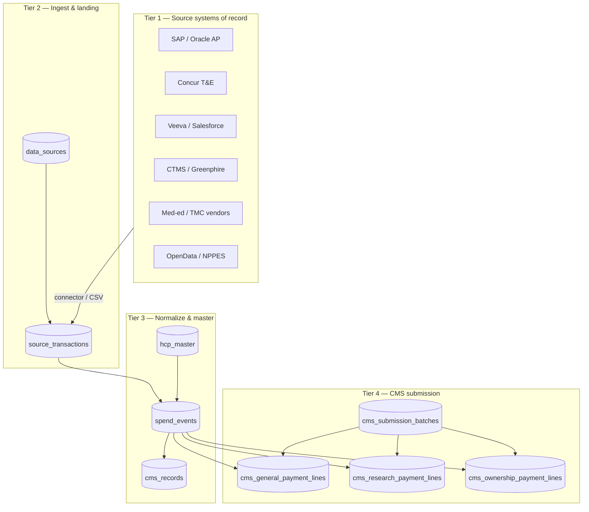
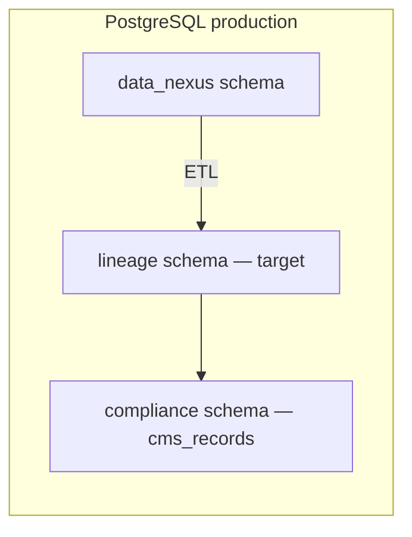

# Data Architecture — Lineage & CMS Submission

## Purpose

The platform ingests transfers of value (ToV) from heterogeneous enterprise systems (ERP, T&E, CRM, CTMS, vendors), applies transparency rules, and produces **CMS Open Payments–ready submission records** with full **provenance** — the ability to prove, years later, exactly how a published dollar was derived.

Reference: [CMS Open Payments Methodology & Data Dictionary (January 2025)](../docs/open_payments_data_dictionary_methodology-january_2025.pdf)

---

## Four-tier model



| Tier | Responsibility | Mutability |
|------|----------------|------------|
| **1 — Source SoR** | Cash, contracts, events in SAP, Concur, CRM, etc. | Owned by upstream systems |
| **2 — Ingest** | Immutable raw payload + source registry | Append-only; dedupe by `payloadHash` |
| **3 — Normalize** | HCP resolution, dedup keys, rules, workflow | Mutable status; audit logged |
| **4 — Submission** | CMS PUF-shaped lines + attestation batches | Versioned via `change_type`, batches |

---

## Ingest pipeline (implemented)

Every CSV upload row (and future API feeds) executes:

```
1. DataSource lookup        (e.g. csv_upload, concur, sap_ap)
2. SourceTransaction create (rawPayload + SHA-256 payloadHash)
3. HcpMaster upsert         (NPI > CMS profile > name|state key)
4. SpendEvent create        (amount, dedupKey, cmsCategory, rule snapshot)
5. PUF line create          (general | research | ownership based on rules)
6. CMSRecord link           (spendEventId for legacy UI / review workflow)
```

Implementation: `cms-compliance-nextjs/src/lib/lineage/ingest-pipeline.ts`

### Dedup strategy

`dedupKey = SHA256(sourceKey | record_id | npi/profile | last_name | date | nature | amount)`

`dedupClusterId` starts equal to `dedupKey`; future merges (Concur + Cvent same dinner) set shared cluster ID on colliding events.

### Rules & replay

Each `SpendEvent` and PUF line stores:

- `rulesEngineVersion` — e.g. `transparency-rules-1.0`
- `ruleInputSnapshot` — raw row, analysis output, applicable rules, currency normalization

This satisfies the **deterministic audit-replay** requirement from COM-TRANSP-001.

---

## CMS three-file model

CMS requires **three separate Public Use File types** (Data Dictionary §2.4):

| File type | Prisma model | Field count | When used |
|-----------|--------------|-------------|-----------|
| General payments | `CmsGeneralPaymentLine` | 91 | ToV not under research protocol |
| Research payments | `CmsResearchPaymentLine` | 252+ (JSON) | Payments under research agreement |
| Ownership | `CmsOwnershipPaymentLine` | 30 | Physician ownership / investment interest |

Category assignment: transparency rules engine sets `cmsReportCategory` → ingest pipeline routes to correct PUF table.

---

## Database (PostgreSQL)

### Production & local development

- Prisma schema: `cms-compliance-nextjs/prisma/schema.prisma` (**PostgreSQL**)
- Local Docker: `docker compose up postgres -d` → `localhost:5433`
- Bootstrap schemas: `database/init.sql` (`data_nexus`, service schemas)
- Migrations: `npx prisma migrate deploy` + `npx prisma db seed`

### Legacy note

SQLite (`prisma/dev.db`) was used in early demos; Sprint B cut over to PostgreSQL with baseline migration `20250603120000_postgres_baseline`.



---

## API surface

| Endpoint | Action | Description |
|----------|--------|-------------|
| `GET /api/lineage` | `stats` | Counts: sources, HCP, transactions, PUF lines |
| `GET /api/lineage` | `recent` | Last 20 spend events with source + HCP |
| `GET /api/lineage` | `trace&spendEventId=` | Full chain: source → HCP → PUF → CMSRecord |
| `GET /api/lineage` | `export-general` | 91-column CMS general PUF CSV |
| `POST /api/lineage` | `create-batch` | Draft `CmsSubmissionBatch` |

UI: Dashboard → **Lineage** tab (`LineageDashboard.tsx`)

---

## Relationship to legacy `cms_records`

`CMSRecord` remains the **review workflow** table (human approve/reject, dispute, aggregate status). New uploads set `CMSRecord.spendEventId` linking to the lineage chain.

Export priority:

1. If `cms_general_payment_lines` exist for program year → **91-column PUF export**
2. Else → legacy 29-column subset from `cms_records`

---

## Security & retention

| Data class | Retention guidance |
|------------|-------------------|
| `source_transactions.rawPayload` | 7 years (CMS audit) |
| `ruleInputSnapshot` | 7 years |
| `hcp_master` | Life of program + 2 years |
| PUF lines post-attestation | Immutable; changes via new `change_type` row |

See `docs/CMS Transparency.md` REQ-013/014 for dispute workflow alignment.

---

## Failure modes addressed

| Risk | Architectural answer |
|------|---------------------|
| Identity resolution | `HcpMaster` + `sourceCrosswalk` JSON |
| Deduplication | `dedupKey` / `dedupClusterId` on `SpendEvent` |
| Indirect / third-party spend | Third-party fields in general PUF + vendor `DataSource` category |
| Categorization disputes | `ruleInputSnapshot` stored at decision time |
| CMS field drift | `pufFields` JSON typed against `cms-puf.ts`; export uses canonical 91-header list |

---

## Next integration phases

1. **Connectors** — Concur, SAP IDoc, Veeva REST → `SourceTransaction` without CSV
2. **Dedup UI** — Surface `dedupClusterId` collisions for analyst merge
3. **PostgreSQL cutover** — Prisma `DATABASE_URL` → Postgres; migrate `data_nexus`
4. **Direct CMS portal submission** — Batch attestation API (REQ-012)

See [SOURCE_SYSTEMS.md](./SOURCE_SYSTEMS.md) for connector priority order.
