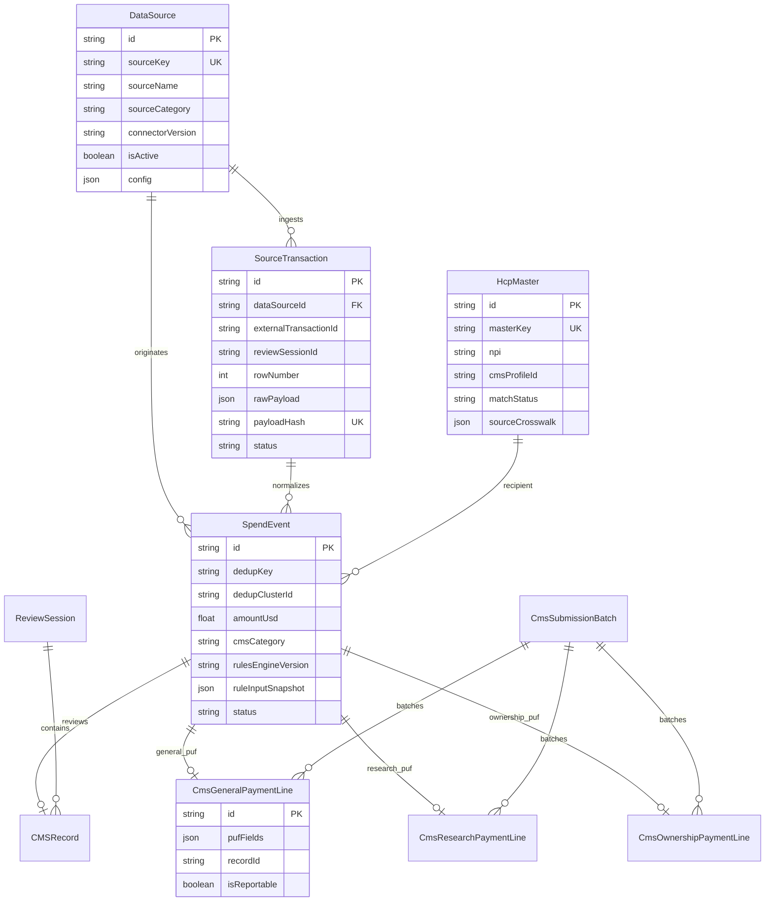

# Lineage Schema Reference

Prisma definitions: `cms-compliance-nextjs/prisma/schema.prisma`  
Physical tables use snake_case via `@@map`.

---

## Entity relationship diagram



---

## Tables

### `data_sources`

Registry of upstream systems of record. Seeded with 20 connectors on `npm run db:seed`.

| Column | Type | Notes |
|--------|------|-------|
| `source_key` | TEXT UNIQUE | Stable connector id, e.g. `concur`, `sap_ap` |
| `source_category` | TEXT | `financial`, `travel`, `crm`, `clinical`, `vendor`, `mdm`, `upload`, … |
| `connector_version` | TEXT | Semver of field mapping logic |
| `config` | JSON | Endpoint URLs, credentials refs (not secrets) |

### `source_transactions`

Immutable ingest log. One row per unique payload per source.

| Column | Type | Notes |
|--------|------|-------|
| `raw_payload` | JSON | Exact upstream row as received |
| `payload_hash` | TEXT | SHA-256 of `raw_payload`; unique with `data_source_id` |
| `review_session_id` | TEXT | Links to CSV upload session |
| `row_number` | INT | Original file row index |
| `status` | TEXT | `received` → `processed` |

**Constraint:** `UNIQUE(data_source_id, payload_hash)` prevents duplicate ingest.

### `hcp_master`

Covered recipient master data (Tier 3 MDM).

| Column | Type | Notes |
|--------|------|-------|
| `master_key` | TEXT UNIQUE | `npi:{npi}` or `profile:{id}` or `name:{last\|first\|state}` |
| `match_status` | TEXT | `pending`, `verified_nppes`, `verified_cms`, `manual` |
| `source_crosswalk` | JSON | `{ "concur": "exp-123", "veeva_crm": "call-456" }` |
| `license_state_codes` | JSON | Array of up to 5 license states |

**Indexes:** `npi`, `cms_profile_id`

### `spend_events`

Normalized transfer of value — the unit rules engine evaluates.

| Column | Type | Notes |
|--------|------|-------|
| `dedup_key` | TEXT | Hash for exact duplicate detection |
| `dedup_cluster_id` | TEXT | Shared id when multiple sources describe same ToV |
| `is_primary_line` | BOOLEAN | False for merged secondary rows |
| `amount_usd` | REAL | Post–FX normalization |
| `cms_category` | TEXT | `general`, `research`, `ownership` |
| `normalization_version` | TEXT | Mapper version, e.g. `cms-puf-mapper-2025-01` |
| `rules_engine_version` | TEXT | e.g. `transparency-rules-1.0` |
| `rule_input_snapshot` | JSON | Full inputs + analysis at rule time |
| `status` | TEXT | See lifecycle below |

**Indexes:** `dedup_key`, `dedup_cluster_id`, `program_year`

#### Spend event status lifecycle

```
received → normalized → ruled_reportable | ruled_non_reportable → submitted
```

### `cms_general_payment_lines`

CMS General Payment PUF (PY 2016+, **91 fields** in `puf_fields` JSON).

| Column | Type | Notes |
|--------|------|-------|
| `puf_fields` | JSON | Full `CmsGeneralPufFields` object |
| `record_id` | TEXT | CMS `Record_ID` |
| `covered_recipient_npi` | TEXT | Denormalized for query |
| `total_amount` | REAL | Denormalized for aggregate queries |
| `change_type` | TEXT | `N` new, `C` change, `D` delete (CMS refresh semantics) |
| `is_reportable` | BOOLEAN | Post-rules flag |
| `rule_input_snapshot` | JSON | Copy at PUF creation |

### `cms_research_payment_lines`

Research PUF. Core columns denormalized; full 252-field shape in `puf_fields`.

| Column | Type | Notes |
|--------|------|-------|
| `name_of_study` | TEXT | |
| `clinical_trials_id` | TEXT | `ClinicalTrials.gov` NCT id |
| `preclinical_indicator` | TEXT | |

### `cms_ownership_payment_lines`

Ownership PUF (**30 fields** in `puf_fields` JSON).

| Column | Type | Notes |
|--------|------|-------|
| `physician_npi` | TEXT | |
| `total_amount_invested` | REAL | |
| `value_of_interest` | REAL | |

### `cms_submission_batches`

Groups PUF lines for attestation and export.

| Column | Type | Notes |
|--------|------|-------|
| `batch_key` | TEXT UNIQUE | e.g. `BATCH_2024_general_1738…` |
| `file_type` | TEXT | `general`, `research`, `ownership`, `mixed` |
| `status` | TEXT | `draft` → `attested` → `submitted` |
| `export_hash` | TEXT | SHA-256 of exported CSV at attestation |
| `attested_at` / `attested_by` | | Compliance sign-off |

---

## Legacy tables (unchanged role)

| Table | Role |
|-------|------|
| `cms_records` | Review UI, dispute workflow, aggregate threshold; links via `spend_event_id` |
| `review_sessions` | Upload batch metadata |
| `company_rules` | Customer-specific rule overlays |
| `audit_logs` | Platform audit trail |
| `users` | RBAC |

---

## PostgreSQL `data_nexus` (init.sql)

Existing landing zone for microservices architecture:

```sql
data_nexus.data_sources   -- connector registry (parallel concept to DataSource)
data_nexus.data_records   -- raw_data + normalized_data JSONB + data_hash
```

**Convergence plan:** ETL from `data_nexus.data_records` into Prisma lineage tables when deploying PostgreSQL. Field mapping documented in [SOURCE_SYSTEMS.md](./SOURCE_SYSTEMS.md).

---

## Migrations

```bash
# Development (SQLite)
cd cms-compliance-nextjs
npx prisma db push
npx prisma generate

# Production (when PostgreSQL enabled)
npx prisma migrate deploy
```

Migration history: `cms-compliance-nextjs/prisma/migrations/`
