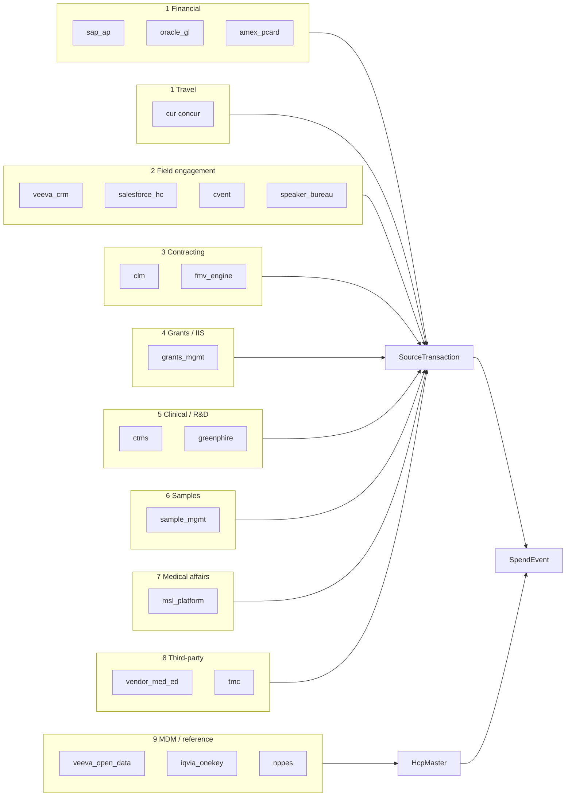

# Source Systems of Record — Integration Map

Maps the ten enterprise source categories to platform `DataSource` registry, ingest path, and CMS PUF destination.

Registry seed: `cms-compliance-nextjs/src/lib/lineage/hcp-master-service.ts` (`DEFAULT_DATA_SOURCES`)

---

## Category overview



---

## Detailed mapping

| # | Category | `source_key` | Typical CMS PUF | Primary fields sourced | Integration friction |
|---|----------|--------------|-----------------|------------------------|----------------------|
| 1 | ERP / GL | `sap_ap`, `oracle_gl` | General (indirect) | Amount, date, vendor; rarely HCP directly | **High** — vendor ≠ HCP; needs indirect attribution |
| 1 | P-card | `amex_pcard` | General | Small field spend, merchant category | **Medium** — HCP attribution from memo |
| 1 | T&E | `concur` | General | Meals, travel, lodging, attendees | **High** — attendee splits, multi-HCP meals |
| 2 | CRM | `veeva_crm`, `salesforce_hc` | General | Call meals, samples logged | **Medium** — point-of-contact capture |
| 2 | Events | `cvent`, `speaker_bureau` | General | Honoraria, F&B, registration | **High** — allocation across attendees |
| 3 | CLM / FMV | `clm`, `fmv_engine` | General | Contract rate, consulting category | **Medium** — rate vs actual reconciliation |
| 4 | Grants | `grants_mgmt` | Research / General | Grant type, recipient institution | **Medium** — research vs grant categorization |
| 5 | CTMS | `ctms`, `greenphire` | **Research** | PI, site, NCT, protocol | **High** — 252-field research PUF |
| 6 | Samples | `sample_mgmt` | Exempt (ingest + filter) | Sample type, quantity | **Low** capture — **High** rules (exclusion) |
| 7 | Medical affairs | `msl_platform` | General | MSL meals, travel | **Medium** — outside commercial CRM |
| 8 | Vendors | `vendor_med_ed`, `tmc` | General + third-party | Lump invoice → HCP allocation | **Critical** — silent gap if not captured |
| 9 | MDM | `veeva_open_data`, `iqvia_onekey`, `nppes` | All PUF types | NPI, profile ID, address | **Required** — validation gate |
| 10 | Upload / platform | `csv_upload` | All | Manual / bulk CSV | **Low** — implemented today |

---

## Ingest status

| `source_key` | Connector status | Ingest method |
|--------------|------------------|---------------|
| `csv_upload` | **Live** | `POST /api/upload` → `ingestSourceRow()` |
| `concur`, `cvent`, `veeva_crm`, `vendor_med_ed`, `tmc` | **Live** | `POST /api/lineage/connectors` |
| `ctms`, `greenphire` | **Live** | Research PUF ingest via connector API |
| `fmv_engine` | **Live (sync)** | `POST /api/connectors/fmv/sync` → `fmv_rates` table |
| `clm` | **Registered** | Await connector; rates via FMV sync |
| `nppes`, `veeva_open_data` | **Reference + ingest gate** | NPPES verify at ingest; MDM enrich |

---

## PostgreSQL `data_nexus` alignment

`database/init.sql` defines parallel structures for service-mesh ingest:

```sql
data_nexus.data_sources (
  source_id, source_name, source_type,
  connection_config, data_schema, last_sync
)

data_nexus.data_records (
  source_id, entity_type, entity_id,
  raw_data, normalized_data, data_hash, validation_status
)
```

| Prisma (app) | PostgreSQL (target) |
|--------------|---------------------|
| `DataSource` | `data_nexus.data_sources` |
| `SourceTransaction.raw_payload` | `data_nexus.data_records.raw_data` |
| `SourceTransaction.payload_hash` | `data_nexus.data_records.data_hash` |
| `SpendEvent` + PUF lines | `data_nexus.data_records.normalized_data` → ETL → lineage schema |

---

## Connector priority (recommended build order)

| Priority | Source | Rationale |
|----------|--------|-----------|
| **P0** | `concur` | Richest general-payment feed; dedup with events |
| **P0** | `vendor_med_ed`, `tmc` | Closes third-party / indirect gap |
| **P0** | `nppes` + `veeva_open_data` | CMS match validation (NPPES on ingest) |
| **P1** | `ctms`, `greenphire` | Research PUF completeness (**implemented**) |
| **P1** | `veeva_crm`, `cvent` | High dispute categories (meals, speaker programs) |
| **P2** | `sap_ap` | Treasury / honoraria only where paid direct to HCP |
| **P2** | `sample_mgmt` | Exemption pipeline, not omission |

---

## Future connector contract

Each connector POSTs to (planned) `/api/lineage/ingest`:

```json
{
  "sourceKey": "concur",
  "externalTransactionId": "EXP-2024-99182",
  "rawRow": { "...": "upstream fields" },
  "reviewSessionId": "optional-batch-id"
}
```

Response: `{ sourceTransactionId, spendEventId, hcpMasterId, pufLineId, cmsCategory }`

Same pipeline as CSV upload; `sourceKey` determines `DataSource` and dedup namespace.

---

## Four program failure modes → source coverage

| Failure mode | Sources most affected | Schema support |
|--------------|----------------------|----------------|
| Identity resolution | All + MDM | `HcpMaster`, `sourceCrosswalk` |
| Deduplication | Concur + Cvent + CRM | `dedupKey`, `dedupClusterId` |
| Indirect attribution | Vendors, SAP AP | Third-party PUF fields + vendor sources |
| Categorization / FMV | CLM, CTMS, grants | `cmsCategory`, `ruleInputSnapshot` |

See [ARCHITECTURE.md](./ARCHITECTURE.md) for tier model and audit replay design.
